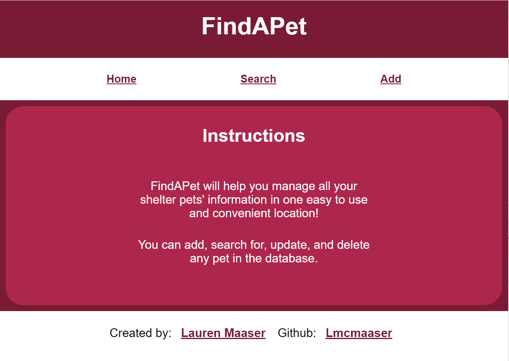
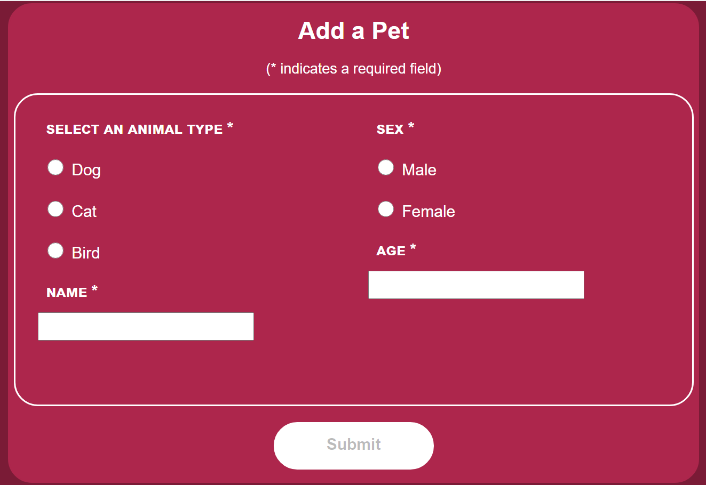
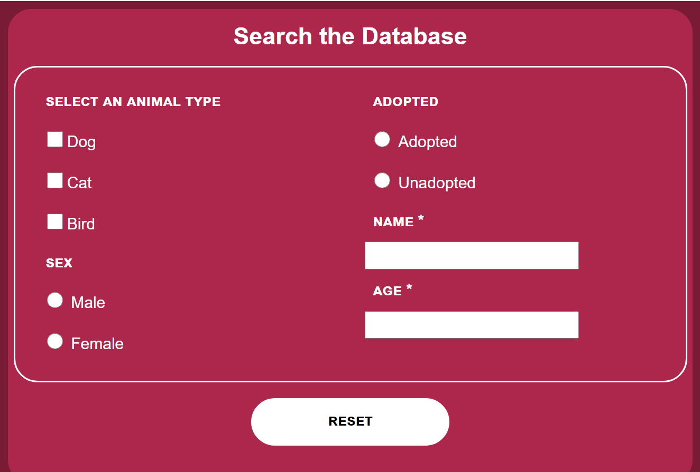
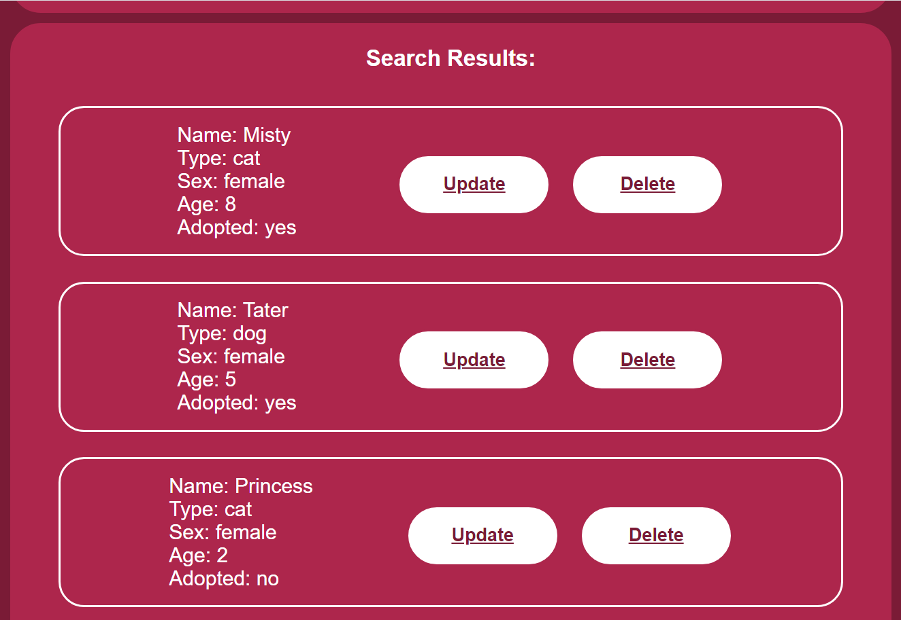

FindAPet

Link to live app: https://findapet-client.now.sh/

Description:
  The FindAPet api (https://github.com/Lmcmaaser/findapet-server) is a sever, that uses node express to connect to a postgres database. It contains endpoints for GET and POST requests (route '/'), as well as ALL, GET, DELETE, and PATCH (route '/:id').

  FindAPet will help you manage all your shelter pets' information in one easy to use and convenient location. As a user, you can add, search for, and update any pet in the database.

Technology used:
  This app uses Javascript, React, HTML/JSX, CSS, Node, Express, and PostgreSQL. It is deployed on Vercel and Heroku.

  This project was bootstrapped with [Create React App](https://github.com/facebook/create-react-app).

Screenshots:

